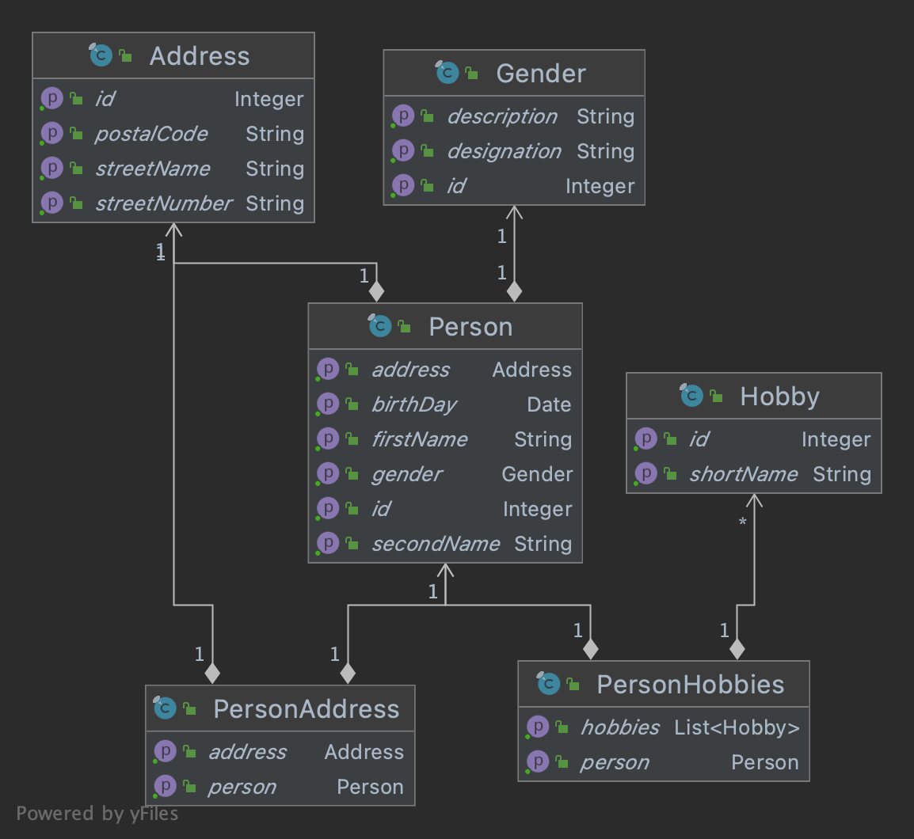
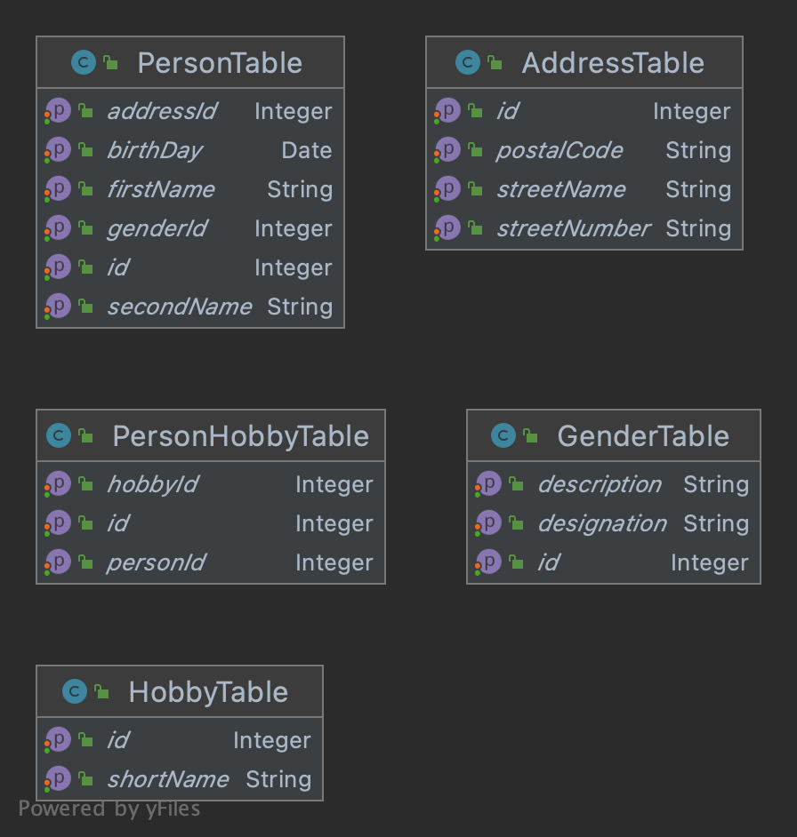

# Api Testing in Apg

Ein labor projekt mit typischen, wenn auch simplen Rest API Verwendungsszenarien

Das Projekt wird im Zuge von ersten Iterationen fur die Evalution und
Definition einer API Testing Toolchain verwendet

## Integrations Testing Apg Ist

### Ansätze Testdaten Bereitstellung
- (a) außerhalb der Tests gemanagte und vordefinierte Testdaten für
  einen applications Kontext (Light)
- (b) (automatisierte) Suche nach geeigneten Testdaten (Clones, Light)
- (c) (automatisiertes) Kreieren von Testdaten (Clones,
  Light)
- (d) Kombination von a) , b), c)

### Test "End Points" der Integrations Tests

- Db: F- und V-Schicht (View und Stored Procedures)
- Spring Service Komponenten: @Service - , @Component- Annotationen
- Spring Rest Controller: Tests gegen laufenden Container
- Spring Mock Rest Controller: Test gegen gemockte Container Environment
- Test Projekte

### Tooling

- Manuell via IT21 UI und PlSql Developer
- Manuell via PlSql Developer
- Windows Bat Scripts (sqlPlus)
- Diverses Java Tooling, siehe unten
- Jenkins Builds mit Java Tests
- Jenkins Pipeline mit Java Tests

#### Java Tooling

- [JUnit <= 4.x](https://junit.org/junit4/) : Java "Standard" mit
  Limitations
- [Junit >= 5 (Jupiter)](https://junit.org/junit5/) : Adressiert <=
  Junit 4 Limitations
- [DbUnit](http://dbunit.sourceforge.net) : Vor allem fur Datenbank
  zentrisches Testen aus einer Java Umgebung
- [TestNg](https://testng.org/doc/) : Adressiert <= Junit 4 Limitations,
  Test Gruppen , Abläufe, Test Methoden spezifische Setups etc
- [Spring Boot Test](https://spring.io/guides/gs/testing-web/) : Spring
  Boot instrumentieren fur JUnit Tests
- [Spock](https://spockframework.org) : Groovy basiertes Test Framework,
  intuitiv , DSL, adressiert <= Junit 4 Limitations

### Automatisiertes Testen von IT21 Funktionalität

Die folgenden applications Bereiche werden mit automatisieren
funktionalen Integrationstests getestet:

- PVA-Abgabenberechung (PLSQL)
- PM-Bruttopreisermittlung (PLSQL)
- Fakturierungstest (PLSQL)
- Verkaufspapiere (Birt, Java , Xtend)
- Preisermittlung (PLSQL)
- PZ-UP (PLSQL, Testdaten via Excel)

## Scope des Projektes

Wahl einer Toolchain, welches automatisierte Integrationstests von IT21
Funktionalität, die auf dem [Rest Api](https://restfulapi.net) eines
Anwendungsgebietes aufsetzen, ermöglicht.

Proof of Concept des Ansatzes anhand eines ausgewählten
Anwendungsgebietes (Verkauf).

Grundsätzlich baut das Projekt auf den Test Erfahrungen in der Apg auf.
Es kann mit den erarbeiteten Findings allenfalls Input zur Verbesserung
eines oder mehrerer der in der Apg etablierten Test Ansätze liefern. Es
wird aber nicht grundsätzlich an den immanenten Restriktionen
ändern können.

Das Projekt soll jedoch die Erwartungen, respektive die Voraussetzungen
aus Sicht des Testens an die Restschnittstellen der Java Service
Projekte mit definieren.

## Test Projekt

### Motivation

- Konzentration / Reduktion / Vereinfachung auf die das Wesentliche
- Was ist ein Rest API
- Building Blocks / Schichten
- Erste Tool Evaluation / Eindrücke
- Das Testprojekt ist einfach erweiterbar, auch um gegebenen Falls neue
  Anforderungen zu adressieren

### Implementation

Das Projekt ist als Multi Module Projekt aufgesetzt:

1. API Schicht: [api](api)
2. Service Schicht: [service](service)
3. Db Schicht: [db](db)
4. Spring Boot Server mit einem Rest Controller: [server](server)
5. Spring Boot Client: [client](client)
6. Utils: [utils](utils)
7. Die getesteten Tools mit Java Build Integration: [tools](tools)

     7.1 [Karate DSL](tools/karate)  
     7.2 [JBang](tools/jbang)

Die [API Schicht](api) exportiert mit dem Service Interface
[PersonManagerService](api/src/main/java/com/apgsga/testing/sample/api/PersonManagerService.java)
Value Objects wie sie von einem Client verwendet werden.

Das Model der Value Object ist das folgende

Das Api hat 4 Implementation:

1. [PersonManagerServiceImpl](service/src/main/java/com/apgsga/testing/sample/service/PersonManagerServiceImpl.java)
   der [Service Sicht](service)
2. Der Restcontroller
   [PersonManagerController](server/src/main/java/com/apgsga/testing/sample/server/PersonManagerController.java)
   in der [Server Schicht](server)
3. Ein
   [Spring Rest Template](https://docs.spring.io/spring-framework/docs/current/javadoc-api/org/springframework/web/client/RestTemplate.html)
   basierter
   [RestClient](client/src/main/java/com/apgsga/testing/sample/client/rest/RestClient.java)
   in der [Client Schicht](client)

Zusätzlich hat die [Client Schicht](client) ein Spring Boot basierter
[Client Builder](client/src/main/java/com/apgsga/testing/sample/client/ClientBuilder.java),
welcher abhängig vom aktiven spring profile "rest" oder "direct" den
[RestClient](client/src/main/java/com/apgsga/testing/sample/client/rest/RestClient.java)
oder die direkte Service
[Service Implementation](service/src/main/java/com/apgsga/testing/sample/service/PersonManagerServiceImpl.java)
bootstrappt und dem Aufrufer zurückgibt. Dh grundsätzlich kann der
Client mit einer Rest Client Implementation oder der direkten Service
Implementation ausgeführt werden.

Die Implementation der [Datenbank Schicht](db) basiert aktuell auf dem
der In Memory Db H2. Die Daten Objekte

mappen 1:1 zum [Schema](db/src/main/resources/sql/schema.sql), welches
bei Start-up von Spring Data Jdbc kreiert werden. Als
Implementations-Schnittstelle wird
[Spring Data Jdbc](https://spring.io/projects/spring-data-jdbc)

Die
[Service Schicht](service/src/main/java/com/apgsga/testing/sample/service/PersonManagerServiceImpl.java)
is der Mediator zwischen API Objekten und der Datenbank Schicht.
Grundsätzlich werden in unterschiedlichen Verwendungsszenarien die Daten
dieser beiden Schicht immer wieder gleich gemappt, deshalb ist das
Mapping zentralisiert im
[PersonManagerMapper](service/src/main/java/com/apgsga/testing/sample/service/PersonManagerMapper.java)
mit [Mapstruct](https://mapstruct.org)

Das Projekt zeigt auch – nicht abschließend – die verschiedenen
automatisierten Java basierten Tests der unterschiedlichen Schichten:

1. Die Db Sicht in
   [SampleDbTests](db/src/test/java/com/apgsga/testing/sample/db/SampleDbTests.java)
2. Die Service Sicht in
   [PersonManagerServiceImplTests](service/src/test/java/com/apgsga/testing/sample/service/PersonManagerServiceImplTests.java)

In der aktuellen Implementation fehlen die Client and die RestController
Tests, da diese der Gegenstand der Toolchain Evaluation ist, siehe auch
die Sub-directories von [tools](tools) und die dort implementiert
werden.

In [utils](utils) ist [Value Object zu Json File
Converter fur Address](utils/src/main/java/com/apgsga/testing/utils/json/CreateAddressJson.java)
implementiert. Nützlich für den, dem die JSON Notation nicht gerade
geläufig ist oder schreib faul ist.

### Preconditions

- [Git](https://git-scm.com/downloads)
- Java Version >= 8 installiert
- IDE, welches Gradle Projekte importieren kann

Die Shell scripts, welche im Projekt verwendet wurden als Bash Scripts
geschrieben. Analog können auch fuer Windows cmd.exe oder powershell
scripts geschrieben werden. Allenfalls ein TO-DO.

Die Gradle Build Scripts werden mit dem Gradle Wrapper ausgeführt. Im
Text wird immer die Unix Variante

`./gradlew ..... `

verwendet. Auf Windows muss diese einfach mit

`gradlew.bat .....`

ersetzt werden.

## Tool Evaluation

###  Aktuelle Kandidatenliste

Quellen:
https://www.softwaretestinghelp.com/api-testing-tools/#1_ReadyAPI
https://medium.com/@alicealdaine/top-10-api-testing-tools-rest-soap-services-5395cb03cfa9

1. [Katalon Studio](https://www.katalon.com) : Kostenpflichtig
2. [SoupUI](https://www.soapui.org) : Kostenpflichtig
3. [Postman](https://www.postman.com) : Gratis, kostenpflichtige Version
4. [Tricentis Tosca](https://www.tricentis.com/products/) : Contract
   Sales
5. [Apigee](https://cloud.google.com/apigee/) : Kostenpflichtig
6. [JMeter](https://jmeter.apache.org) : Open Source
7. [Rest-Assured](https://rest-assured.io) : Open Source
8. [Assertible](https://assertible.com) : Gratis , kostenpflichtige Version
9. [Karate DSL](https://github.com/intuit/karate) : Open Source
10. [Swagger](https://swagger.io/) : Open Source
11. [Rest Console](https://github.com/ahmadnassri/restconsole)
12. [API Fortress](https://apifortress.com) : Contract Sales
13. [Pyresttest](https://github.com/svanoort/pyresttest) : Open Source
14. [Fiddler](https://www.telerik.com/fiddler) : Contract Sales
15. [Airborne](https://github.com/brooklynDev/airborne) : Open Source
16. [Accelq](https://www.accelq.com) : Contact Sales
17. [Helium](https://github.com/stanfy/helium) : Open Source
18. [rest-client](https://github.com/rest-client/rest-client) : Open
    Source
19. [JBang](https://github.com/jbangdev/jbang) : Open Source

Was beim ersten Durchblick auffällt: Es gibt Tools, wie zb Swagger,
welches den ganzen Life-cycle abdecken , dh auch die Spezifikation und
das Entwickeln von Rest API’s.

Im Weiteren gibt es solche, welche ein scriptbares Rest Client DSL
anbieten. Andere welche ein UI basiertes interaktives Zusammenstellen
von Rest Aufrufen erlauben.

Alle Tools, ausser [JBang](https://github.com/jbangdev/jbang) setzen auf
dem Http Protokoll auf.

[JBang](https://github.com/jbangdev/jbang) ist kein Test Framework, aber
erlaubt ein scripting ähnliches Entwicklererlebnis für die Java
Entwicklung. In diesem Scenario wird nicht direkt auf der HTTP Protokoll
Ebene, sondern auf einem Java basierten Client API fur die Tests
aufgesetzt. Die Tests werden in Java implementiert.

### Aktuelle Tool Selektion

Die folgenden Tools sollen gemäss Beschluss vom 25.5 näher untersucht
werden:

1. [Postman](https://www.postman.com)
2. [JBang](https://github.com/jbangdev/jbang)
3. [Karate DSL](https://github.com/intuit/karate)

Im Kontext des Projektes wird möglichst die Standalone Verwendung, dh
eine Verwendung ohne IDE UND die Integration der Tools in ein
automatisiertes Java basiertes Testen, dh von Maven resp Gradle Builds
ausgeführten Tests, untersucht.

Diese Tools sind in einem "dedicated" Sub Folder von [tools](tools)
untersucht und evaluatiert mit einem eigenen README, in welchem auch die
Preconditions fur das Standalone ausführen der Tools und die Findings
zum Tools festgehalten sind.

1. [Curl basierte Scripts](tools/postman/README.md)
2. [Ruby basiertes Script](tools/ruby/README.md)
3. [JBang](tools/jbang/README.md)
4. [Karate DSL](tools/karate/README.md)

(3) und (4) sind als auch als automatisierte Java Tests im Build
integriert.

## Stand

### Completed

- [x] Api siehe
     [PersonManagerService](api/src/main/java/com/apgsga/testing/sample/api/PersonManagerService.java)
- [x] Db und Service Schicht mit Junit5, SpringBoot Tests
- [x] Server ist mit Rest Controller lauffähig
- [x] Rest Controller mit 3
     [Address.java](api/src/main/java/com/apgsga/testing/sample/api/Address.java)
     Methoden implementiert, siehe
     [PersonManagerController](server/src/main/java/com/apgsga/testing/sample/server/PersonManagerController.java)
- [x] Client mit konfigurierbarem Restful vs Direct Modus mit den 3
     Methoden
- [x] Karate und JBang Test Szenarien der 3 Methoden Standalone und als
      Java Tests
- [x] README's vervollständigen (2 PS)

### Offen

- [ ] Security muss vom initialen Testprojekt nachgezogen werden, als
      "Mock" Implementation in der Server Schicht, dh auf Http Header
      Ebene relevant für die implementieren Testszenarien (2 PS)
- [ ] Restcontroller: das API vervollständigen (2 PS)
- [ ] Client: das Rest API vervollständigen (2 PS)
- [ ] Karate und JBang Testszenarios vervollständigen (2 PS)
- [ ] Postman wurde überhaupt noch nicht untersucht, analog zu Karate
      und JBang (1 - 2 PT)
- [ ] Optional: zusätzlich (redundant) Maven pom.xml's und scripts (4
      PS)

Also ca noch ca 3 PT verbleibender Aufwand

## Offene Fragen

- [ ] Test Setup via Rest API oder direkt via JDBC?
- [ ] Verbesserung / Vereinheitlichung Java basierter Tests, Scope?

