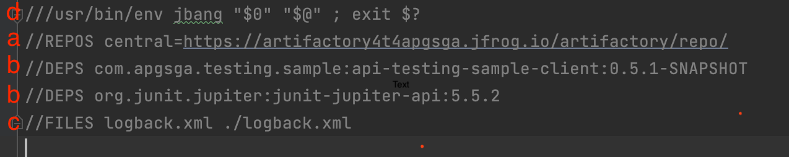
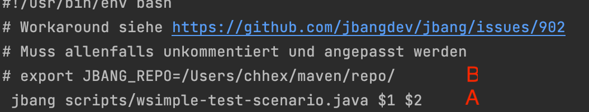

# JBang basierte Client API Tests

## Preconditions

- Installation siehe die
  [JBang installations Anleitung](https://github.com/jbangdev/jbang#installation).
  Für Windows gibt es die Installationsvarianten mit
  [Chocolatey](https://chocolatey.org) oder [Scoop](https://scoop.sh),
  beides sind Opensource Package Manager für Windows ala RPM oder APT
  für Linux. Ich verwende / kenne [Chocolatey](https://chocolatey.org).
  Sehr praktisch mit einer sehr grossen Bibliothek
- Note: Es gibt auch die ["Zero" Install
  Variante](https://github.com/jbangdev/jbang#zero-install) für Windows
  und Unixe, die ich allerdings nicht getest habe.
- Apg konformes Maven settings.xml in ~/.m2/


## Implementation

Es werden Files mit Java Code geschrieben. Die Package- respective File-
namen sind allerdings nicht relevant. Das Beispiel Script ist hier
[simple-test-scenario.java](scripts/simple-test-scenario.java)

### JBang

Das File hat einen JBang spezifischen Vorspann:



wobei

- (a) Maven Repository von welchem, die Dependencies geholt werden: Apg
  standard read-only Maven Repository. Setzt das settings.xml voraus,
  von wo der User und Passwort für das "central"  Repository definiert
  sind
- (b) Dependencies fur das script als normale Maven Koordinaten. Der
  Client hier ist als fat/uber JAR publiziert, siehe auch
  [build.gradle](../../client/build.gradle), dh es beinhaltet alle
  Dependencies, welches der Client braucht.
- (c) Es können zusätzliche Files für den Klassenpfad definiert werden
- (d) shebang, damit das script auch direkt ausführt werden kann.
  Bemerkung: Funktioniert bei mir nicht

Für weitere Dokumentation zu JBang, siehe den
[Github Site](https://github.com/jbangdev/jbang)

Bemerkung: JBang ist relative neu : V 0.71.1. Ist noch in Entwicklung

### Java Code

Die effektive Implementation, siehe [simple-test-scenario.java: Lines
22-58](scripts/simple-test-scenario.java#L22-L58) respective Logik, wird
in reinem Java geschrieben.


### Ausführung

Generell wird das File mit JBang ausgeführt, siehe das Script
[run.sh](run.sh)



- (A) : The JBang Aufruf des Scripts mit zwei applikatorischen
  Parametern
- (B) : ["Workaround"](https://github.com/jbangdev/jbang/issues/902) für
  nicht standard Locations des lokalen Maven Repositories. Ist vor allem
  für die Entwicklung mit SNAPSHOT Dependencies wichtig, wenn nicht
  remote publiziert wird. Bei Bedarf allenfalls ent – kommentieren und
  updaten

Dh. Es muss nicht mit javac gebaut werden und als Jar publiziert und
deployt werden. Das Bauen und Packaging von Java Programmen ist mit
JBang nicht mehr notwendig.

Das konkrete script hat zwei Parameter:

- $1 : Modus: direct / rest
- $2 : baseUrl , zb http://localhost:8080

d.h zwei Ausführungsvarianten

1. Ohne Rest Server, dh. direkt auf der Service Implementation.

`./run.sh direct`

1. Gegen den Rest Server

Im Root directory des Projektes:

`./gradlew bootRun --info`

Und in einer neuer Shell in diesem Directory:

`./run.sh rest`

oder z. B.

`./run.sh rest http://localhost:8080`


Auf Windows analog mit Powershell oder cmd.exe

### Java Build Integration

Hier mit einem [Gradle Build](build.gradle). Es wird das [Bang Gradle
Plugin](https://github.com/jbangdev/jbang-gradle-plugin) verwendet. Es
gibt auch ein analoges
[Maven Plugin](https://github.com/jbangdev/jbang-maven-plugin)

Mit diesen können JBang scripts in Java Build Ketten integriert werden.

### Java API

Das Karate DSL stellt auch ein
[Java API](https://github.com/intuit/karate#java-api) zur Verfügung,
welches zum Beispiel auch einem JBang Scenario verwendet werden kann:

```
///usr/bin/env jbang "$0" "$@" ; exit $? 
//DEPS com.intuit.karate:karate-core:RELEASE

import com.intuit.karate.*;
import java.util.List;

public class javadsl {

    public static void main(String[] args) {
        List users = Http.to("https://jsonplaceholder.typicode.com/users")
                .get().json().asList();
        Match.that(users.get(0)).contains("{ name: 'Leanne Graham' }");
        String city = Json.of(users).get("$[0].address.city");
        Match.that("Gwenborough").isEqualTo(city);
        System.out.println("\n*** second user: " + Json.of(users.get(1)).toString());
    }

}
```
### IDE Integration

Es gibt keine speziellen JBang IDE's respective Plugins. Grundsätzlich
sind die Scripts ja auch reines Java mit etwas Beigemüse.

Aber auch Gründen der einfacheren Entwicklung ist es von Vorteil, wenn
die JBang Scripts als Maven oder Gradle Projekte aufgesetzt sind:
Stichwort Dependency Resolution und Context Sensitivity.

## Offener Punkt

- [ ] Das packaging der JBang Test Scripts. Als Git Repository,
      höchstwahrscheinlich.
- [ ] Consider eigenes Apg spezifisch JBang Repo, in sogenannten
      Catalogs, see https://github.com/jbangdev/jbang#catalogs. Das
      sollte sehr einfach sein.
- [ ] Debuggen muss noch untersucht werden
