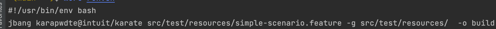

# Karate Dsl basierte Rest API Tests

## Preconditions

- Die Standalone Version von Karate DSL kann mit JBang, siehe die
  [JBang installations Anleitung](https://github.com/jbangdev/jbang#installation)
  installiert werden. Siehe auch das
  [Karate DSL README hier](../jbang/README.md)

## Implementation

Die Karate DSL Tests werden in sogenannten *.feature Files eigenständig
spezifiziert, siehe das script
[simple-scenario.feature](src/test/resources/simple-scenario.feature).
EIn Feature File kann 1 bis n Testszenarios beinhalten. Jedes
Testszenario kann enthält n Tests. Die Tests werden in der Karate DSL
Notation festgehalten. Funktionale Logik wird mit JavaScript
programmiert, siehe auch ein reines funktionales Script:
[some-reuseable.feature](src/test/resources/some-reuseable.feature).  
Dieses script wird auch im
[simple-scenario.feature](src/test/resources/simple-scenario.feature)
beispielhaft aufgerufen und gelesen.

Das hier implementierte Beispiel schürft nur an der Oberfläche der
reichen Möglichkeiten von [Karate DSL](https://github.com/intuit/karate)

### Ausführung

#### Standalone

Zuerst muss allenfalls der Server gestartet werden im Root directory des
Projektes:

`./gradlew bootrun --info`

Falls der Port und / oder das Url sich ändert muss die
[Karate Dsl Konfiguration Datei](src/test/resources/karate-config.js)

Standalone Karate DSL feature's werden mit JBang ausgeführt, siehe das
Script [run.sh](run.sh)



mit folgenden Parameter Optionen:

- g : das Directory mit der Karate Konfiguration
  [karate-config.js](src/test/resources/karate-config.js)
- o : Das Output
  Directory mit den Test Result Reports etc

### Java Build Integration

Hier mit einem [Gradle Build](build.gradle). Es braucht kein spezielles
Plugin.

Die notwendigen Dependencies werden als Test Dependencies deklariert,
siehe [build.gradle: Line 17](build.gradle#L17)

Es werden Junit Klassen deklariert, siehe
[KarateTests.java](src/test/java/KarateTests.java) Die feature File
werden mit speziellem Karate Test Annotationen und Hilfsklassen
ausgeführt, siehe
[KarateTests.java: Line 37](src/test/java/KarateTests.java#L37). Es muss
gewaehrleistet sein das sich neben dem
[Feature File](src/test/resources/simple-scenario.feature) auch das
Konfigurations File
[Konfigurations File](src/test/resources/karate-config.js)sich im
Klassenpfad befindet.

Da der SpringBoot Testrunner die Karate Test Annotationen nicht kennt,
muss Spring Boot von Hand gestartet werden, siehe
[KarateTests.java: Line 28](src/test/java/KarateTests.java#L28)

### Java API

Das Karate DSL stellt auch ein
[Java API](https://github.com/intuit/karate#java-api) zur Verfügung,
welches zum Beispiel auch einem JBang Scenario verwendet werden kann:

```
///usr/bin/env jbang "$0" "$@" ; exit $? 
//DEPS com.intuit.karate:karate-core:RELEASE

import com.intuit.karate.*;
import java.util.List;

public class javadsl {

    public static void main(String[] args) {
        List users = Http.to("https://jsonplaceholder.typicode.com/users")
                .get().json().asList();
        Match.that(users.get(0)).contains("{ name: 'Leanne Graham' }");
        String city = Json.of(users).get("$[0].address.city");
        Match.that("Gwenborough").isEqualTo(city);
        System.out.println("\n*** second user: " + Json.of(users.get(1)).toString());
    }

}
```
### IDE Integration

Damit das DSL erkannt und unterstützt wird, braucht es spezielle IDE
Plugins, bzw Konfigurationen, siehe [IDE Support
im Karate Wiki](https://github.com/intuit/karate/wiki/IDE-Support)

Getestet mit Intellij und
[Visual Code Open Source](https://github.com/microsoft/vscode) auf Macos
=> io.

## Offener Punkt

- [ ] Das packaging der Feature File Scripts plus Konfiguration. Als Git
      Repository, höchstwahrscheinlich. To be discussed.
- [ ] Debuggen
- [ ] Mit Eclipse und auf Windows Testen
